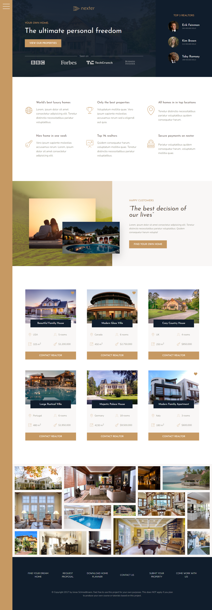

# Advanced-css-and-sass

Taking my CSS skills to the next LEVEL!

- compose of 3 hands-on projects
    - [natour](https://github.com/pkErbynn/advanced-css-and-sass/tree/main/natour)
        - **intro**: a nature tour site simulation
        - **core technology**: float
    - [trillo](https://github.com/pkErbynn/advanced-css-and-sass/tree/main/trillo)
        - **intro**: a fictional all-in-one booking app where user can book hotel, flight, car
        - **core technology**: flexbox
    - [nexter](https://github.com/pkErbynn/advanced-css-and-sass/tree/main/nexter)
        - **intro**: a fictional company called "nexter" which sells luxury home across the world
        - **core technology**: grid

## demo preview

- [Natour](https://github.com/pkErbynn/advanced-css-and-sass/tree/main/natour)

- [Trillo](https://github.com/pkErbynn/advanced-css-and-sass/tree/main/trillo)

- [Nexter](https://github.com/pkErbynn/advanced-css-and-sass/tree/main/nexter)

## useful resource links - @all
* [bennettfeely.com/clippy](bennettfeely.com/clippy)
* [linea.io](linea.io)
* [unsplash.com](unsplash.com)
* [coverr.co](coverr.co)
* [gs.statcounter.com](gs.statcounter.com)
* [sizzy.co](sizzy.co) ...for responsive testing
* [caniuse.com](caniuse.com)
* [icomoon.io](icomoon.io)
 
