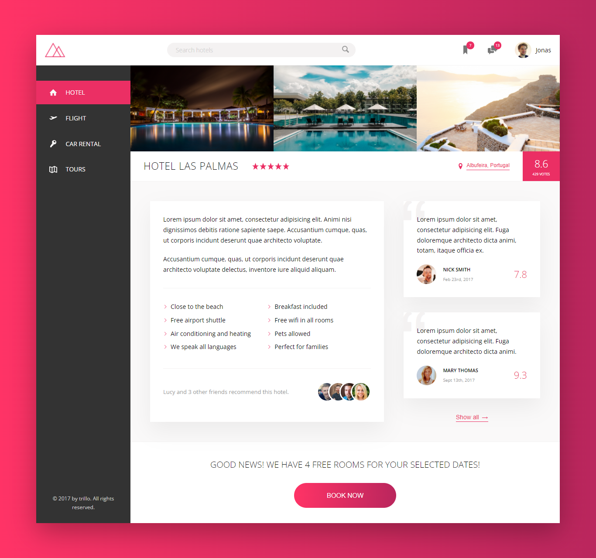

# Trillo
## Flexbox concepts
- Flex container
    - its display set to flex
    - has the ff properties
        - flex-direction
        - flex-wrap ...wraps overflown items to next line/row
        - justify-content ...how items will be positioned (horizontally depending on the flex-direction) to the main axis
        - align-items ...how items will be positioned (vertically depending on the flex-direction) to the cross axis
        - align-content ...how it positions rows vertically across main axis
- Flex items
    - found inside the container
    - can be aligned in main (horizontal) or cross (vertical) axis
    - has the ff properties
        - align-self...aligns a particular / ONE item in the flex-container vertically...overrides container's align-items value
        - order...the order of AN item depending on 0 > value < 0 is set. each item as 0 order value by default 
        - flex-grow...expands item as much as it can occupying more space...depends on other nearby items value (1,2,3..)
        - flex-shrink...0 == non-shrinkable (default), 1 == shrinkable
        - flex-basis...sets flex width basically
            - all together shortened as
                - flew: grow shrink basis; ...eg flex: 0 1 20%;

## Architecture 
Going with simple architecture unlike Natour

- /sass 
    - _base.scss
    - _layout.scss
    - _components.scss

## Core CSS concepts
1. Css custom properties
    - called css variables
    - similar to sass variables
2. use SVG vs IconFont
    - IconFont
        - like images using a font
        - fail often that would think with browser displayin' a black square
        - not screen reader supportive
    - SVG
        - === Scalable Vector Graphics
        - way of writing vector graphics w/ code
        - better alternative, recommended over icon font
        - App support: IcoMoon
            - contains icon sprite
        - NB: only shows on servers
3. advanced flexbox alignment techniques
    - justify-content
    - align-items
    - align-self
    - flex
4. navigation
    - using 'scaleY' and multi properties to create a creative hover effect
    - how & why to use the `currentColorCSS` var
    - using flex alignment techiques: `flex-direction`, `justify-content` and `align-items`
5. hotel content
    - creating an infinit animation
    - `margin: auto` with flexbox
    - flexbox properties for positioning and alignment
5. hotel description setion
    - build multi-column list using `flex-wrap`
    - why and how to use `mask-image` and `mask-size`
6. call-to-action setion
    - creative and modern hover effect
    - `text-align` vs other flex props

## Media queries
Making trillo responsive with small amount of code. 
    - The 'perfect approach' is used 
    - cus breakpoint is set to where it start to break 
    - css custome properties doesn't work with breakpoint variables, thus Sass var is used

## trillo demo 
* Screenshot  

* Animated gif  

